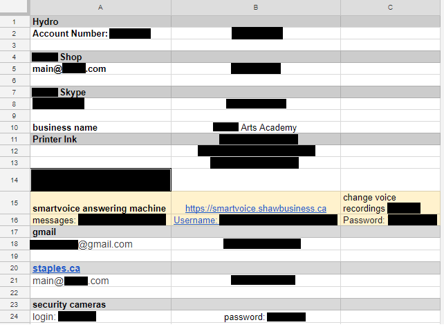

A few months ago, I made a few pieces of pottery through a make-your-own-pottery local business. As part of the clay-making process, customers need to wait for some time for their clay pieces to dry before they’re able to be painted. The business needs to inform customers when their pieces are ready to be painted and picked up after painted.

This business maintains a Google spreadsheet to inform customers when their dried clay is ready to be painted.

While checking to see if my clay items were ready to be painted, I noticed that intriguing `=importrange(…)` in the first cell of the document. I was curious what was in this other Google spreadsheet. So like most curious people, I just **had** to open this new spreadsheet.

## and… I’m in

Imagine to my surprise, that not only did this spreadsheet have more information about the clay drying process, but also contained a treasure trove of sensitive information about this company. There were no privacy controls set on the document. Anyone with a Google account could view the spreadsheet.

Some of the sensitive information available in this new spreadsheet:

- Passwords to the branch’s e-mail account, voice mail service, security cameras, and more
- Employee shift schedule
- Business procedures: cash out, inventory counts, log of damages/losses
- Voice mail logs, and contact information of customers who left the voice mails
- Some customer information: full names and phone numbers
- Gift card tracking, and procedures to create new gift cards

Through this document, one could access their POS system, generate new gift cards, and cause all sorts of other havoc. There were also links to more, unprotected Google docs that contained more information about the company. The passwords within the spreadsheet were current and valid.

Having seen enough, the company was notified via e-mail, and the Google docs spreadsheet had the correct privacy settings applied to it.

It appears that each location of the company has their own spreadsheet like the one above. I attempted to access a couple others and the permissions were set correctly.

## Takeaways

### Permission management is hard

Individually managing the permissions for what must be 50-odd documents is hard. I've never used Google docs at such a scale for information, but I have yet to see any sort of tool for managing permissions for large sets of documents.

### Compartmentalization

Having a single source of information for all data for a business, while convenient, lead to a zero-effort full information disclosure. Storing critical business information, like passwords, in a separate document that isn't linked to any other document would have stopped this attack cold.

### Insecure passwords

Finally, the passwords in the spreadsheet were also very insecure, but that’s a topic for another discussion.

## Disclosure timeline

- 2018/03/23 - Discovered the unprotected Google spreadsheet
- 2018/03/23 - Disclosed the information leak to the business
- 2018/03/23 - Business corrected the permission of the exposed Google spreadsheets
- 2019/01/14 - I decided to blog about it, because I had almost forgotten about this event until today
