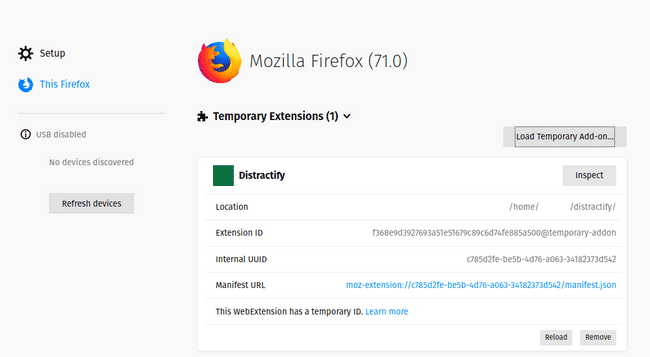
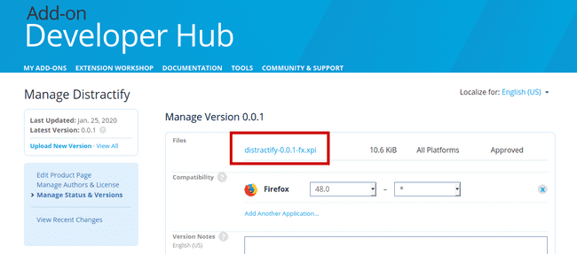

It’s a new year, and that brings new resolutions. One of my resolutions is to reduce time on social media.

I’ve an annoying habit of mindless browsing. Every so often, I will mindlessly open a new browser tab, and immediately start typing `re <enter>` to auto-complete `reddit.com`. I'll then start mindlessly browsing, often spending 5-10 minutes before realizing what I'm doing. To break this habit I’ll be using a browser plugin to stop the reddit navigation. I _could_ download a premade add-on for it; but I’ve had creating a browser plugin on my programming bucket list for a while now.

## Basic add-on

### Create a folder

Create a new folder for your add-on to live in for development purposes. I'll be calling my add-on **distractify**

```bash
mkdir distractify
cd distractify
```

### Create a manifest.json

As the filename indicates, the manifest.json describes the extension:

```json
{
  "manifest_version": 2,

  // Basic name stuff
  "name": "Distractify",
  "version": "0.0.1",
  "description": "Blocks all distracting sites",

  // Define the icons to be used. Not really required for development
  "icons": {
    "48": "icons/distract-48.png"
  },

  // Set the permissions the extension needs
  // In our case, we're accessing webRequest and having the extension run on our domain
  "permissions": ["webRequest", "webRequestBlocking", "*://*.reddit.com/*"],

  // Define a backround script
  "background": {
    "scripts": ["distractify.js"]
  }
}
```

Feel free to use your own icon, or use the one I spent a whole 5 seconds creating:


As you can see above, we’ve defined two files that are currently not used: `icons/distract-48.png`, and `distractify.js`. Go ahead and create `distractify.js` right now.

### Create distractify.js

In our case, this is the logic that defines the behaviour of the extension.

```javascript
// In Chrome, the browser object is `chrome`
// In Firefox, the browser object is `browser`
const isChrome = typeof chrome === 'object';
const browserObject = isChrome ? chrome : browser;

const filter = {
  // Array of url match patterns
  urls: ['*://*.reddit.com/*'],

  // Array of ResourceTypes. We're only concerned with top-level document requests
  types: ['main_frame'],
};

// Sets the handler to be run synchronous, so we can block the request
const extraInfo = ['blocking'];

function handleRequest(details) {
  // Determines the type of cancellation we'd like to do
  // return { cancel: true } will cause the url to go nowhere
  return { redirectUrl: 'https://www.padraig.io' };
}

// Add the event listener to onBeforeRequest
browserObject.webRequest.onBeforeRequest.addListener(
  handleRequest,
  filter,
  extraInfo
);
```

**Note:** the URL filter in on line 9 of the above file. It isn’t fully necessary. This is because the script won’t even run on pages that haven’t been defined in the `permissions` block of the `manifest.json` file. However, it’s been included for completeness’ sake.

## Load it

The next step is to load it as a temporary add-on through your browser. It’s slightly different depending on the browser you are using.

### Firefox

Open a new tab in Firefox, and enter `about:debugging` in the address bar. Click on **This Firefox**, and click on the **Load Temporary Add-on** button. Finally, navigate to your add-on’s manifest.json. To debug an add-on, click the **Inspect** button within the add-on’s **Inspect** button.



### Chrome

Open a new tab in Chrome, and enter `chrome://extensions` in the address bar. Click on the **Developer Mode** toggle switch in the top right hand corner of the screen, followed by **Load unpacked**. Navigate to the folder which houses your manifest.json file. To debug an add-on, click on the **Details** button.


## Adding a persistent counter through local storage

Wouldn’t it be cool if we could count the number of times we’ve mindlessly tried to navigate? Maybe so we could track our progress over time through a S.M.A.R.T. resolution? We can do that!

Extensions get some storage set aside for this sort of thing. The first thing we’ll do is add the `storage` permission to the `manifest.json` file.:

```json
"permissions": [
  "storage", // We now need the storage permission
  "webRequest",
  "webRequestBlocking",
  "*://*.reddit.com/*"
],
```

Next, we’ll add a bit more functionality to the `handleRequest` function:

```javascript
function incrementNumBlocked() {
  const storageKey = 'numBlocked';
  chrome.storage.local.get(storageKey, storage => {
    // Get the actual value from the storage object
    const numBlocked = storage[storageKey];
    // Increment our counter
    const nextBlocked = (numBlocked === undefined ? 0 : numBlocked) + 1;
    // Stick it back in sotrage
    chrome.storage.local.set({ [storageKey]: nextBlocked });
    console.log(`Reddit has been blocked ${nextBlocked} times`);
  });
}

function handleRequest(details) {
  incrementNumBlocked();
  // Determines the type of cancellation we'd like to do
  // return { cancel: true } will cause the url to go nowhere
  return { redirectUrl: 'https://www.padraig.io' };
}
```

Now to check if it works, we load up the extension in the browser’s devtools:

```bash
Reddit has been blocked 1 times distractify.js:24:13
Reddit has been blocked 2 times distractify.js:24:13
```

Unfortunately, we currently have no way of letting the user know the count outside of the devtools. This won’t do! The next step will be to build a toolbar that we can interact with.

## Adding a browser toolbar button

A toolbar button can either do something when clicked, or render a popup of HTML/Javascript. In our case, we’ll use it to render a basic webpage that will display the number of times we’ve blocked the navigation.

First things first, we need to update the `manifest.json` file to add references to the popup:

```json
"browser_action": {
  "default_icon": "icons/distract-48.png",
  "default_title": "Distractify",
  "default_popup": "popup/popup.html",
  "browser_style": true
}
```

Next, we’ll need to define the `popup/popup.html` file:

```html
<!DOCTYPE html>
<html>
  <head>
    <meta charset="UTF-8" />
  </head>
  <body>
    <section>Sites blocked: <span id="blocked"></span></section>
    <script src="popup.js"></script>
  </body>
</html>
```

Note that there is a reference to an external script: `popup.js`. We’ll use that to retrieve the count from the browser extension storage, by copy/pasting a chunk from the `distractify.js` script:

```javascript
// popup/popup.js
// Little bit of copy/paste code from the distractify.js script
const storageKey = 'numBlocked';
chrome.storage.local.get(storageKey, storage => {
  // Get the key from storage
  let numBlocked = storage[storageKey];
  // numBlocked will be undefined if not set yet
  numBlocked = numBlocked === undefined ? 0 : numBlocked;
  // Set it in the HTML document
  document.getElementById('blocked').innerText = numBlocked;
});
```

## Adding the ability to disable the add-on


It would be nice to have the ability to turn off the add-on. We’ll accomplish this by adding a checkbox within the popup that controls the state.

Let’s first add that checkbox to our `popup/popup.html` file:

```html
<section>
  <input type="checkbox" id="enabled" />
  <label for="enabled">
    Enabled
  </label>
</section>
```

Next, we’ll need to hook up the checkbox in `popup/popup.js` to storage

```javascript
// Init checkbox
const enabledCheckbox = document.getElementById('enabled');
const enabledStorageKey = 'isEnabled';
chrome.storage.local.get(enabledStorageKey, storage => {
  // In the case that the flag isn't initialized, we'll cast it to Boolean
  // This probably isn't really needed
  const isEnabled = Boolean(storage[enabledStorageKey]);
  enabledCheckbox.checked = isEnabled;
});

// Set the change callback handler
enabledCheckbox.addEventListener('change', () => {
  chrome.storage.local.set({ [enabledStorageKey]: enabledCheckbox.checked });
});
```

Finally, we need to update the `distractify.js` script to support the `isEnabled` flag. However, things aren’t quite so simple. The APIs to retrieve data from the browser storage are asynchronous, and could potentially be hosted remotely. As we’re blocking an HTTP request, we are unable (and can’t really) wait for the extension to get the value of `isEnabled` every time a new web request ocmes in. Because of this, we’re going to keep a local cache of the flag, and hook the event that is dispatched when the flag is updated:

```javascript
// isEnabled handling
// First thing we do is get the initial value on load
let isEnabled = undefined;
const enabledStorageKey = 'isEnabled';
chrome.storage.local.get(enabledStorageKey, storage => {
  isEnabled = storage[enabledStorageKey];
  // If isEnabled is undefined, we're on the initial load
  // Setting isEnabled to true on first load
  if (isEnabled === undefined) {
    isEnabled = true;
    chrome.storage.local.set({ [enabledStorageKey]: true });
  }
});

// Next, we set an onChanged listener to keep our cached value in-sync
chrome.storage.onChanged.addListener((changes, areaName) => {
  if (areaName !== 'local') {
    return;
  }
  if (enabledStorageKey in changes) {
    isEnabled = changes[enabledStorageKey].newValue;
  }
});
```

Finally. we update the `handleRequest` function to support the `isEnabled` flag:

```javascript
function handleRequest(details) {
  if (!isEnabled) {
    return;
  }
  incrementNumBlocked();
  // Determines the type of cancellation we'd like to do
  // return { cancel: true } will cause the url to go nowhere
  return { redirectUrl: 'https://www.padraig.io' };
}
```

## Publishing the add-on

The final step is to publish the add-on. This will move the add-on from being a temporarily loaded, to one that will persist.

### Firefox

Head over to the [Mozilla Developer Hub](https://addons.mozilla.org/en-US/developers/), and sign up for a new account. After click on **Submit your first add-on**. After potentially filling out some extra information, On the next page, there are two options: **On this site**, and **On your own**. **On this site** makes the add-on publicly viewable on the Firefox extension site; however your add-on will require a review before it can be published. **On your own** is essentially an unlisted/private add-on. As we are just building the add-on for ourselves, we’ll use that. The next step is to zip up the add-on folder, and upload it to the site. Your add-on will need to go through an automated verification step. As the add-on is small, this should happen fairly instantaneously.



To download the add-on, navigate to the version history for the add-on, and then click on the link to the version you just uploaded. Finally, click on the link that looks like `distractify-0.0.1-fx.api`. You will be prompted to install the add-on. Click through!

### Chrome

_Note:_ Google requires a one-time fee of \$5 to publish you first add-on. However, Chrome will persist add-ons that have been loaded for debugging purposes. Therefore, it isn’t required to publish the add-on.

Navigate to the [Chrome Developer Dashboard](https://chrome.google.com/webstore/developer/dashboard), and follow the steps to create, and upload your add-on there.

**Congrats**, you’ve written and published your first add-on!
